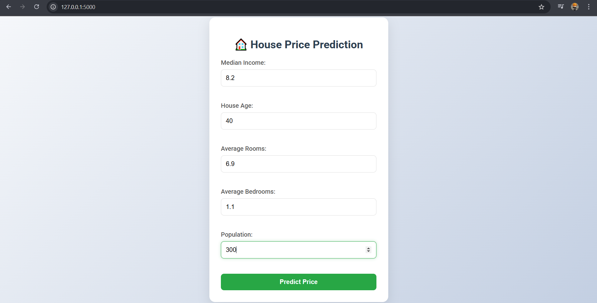
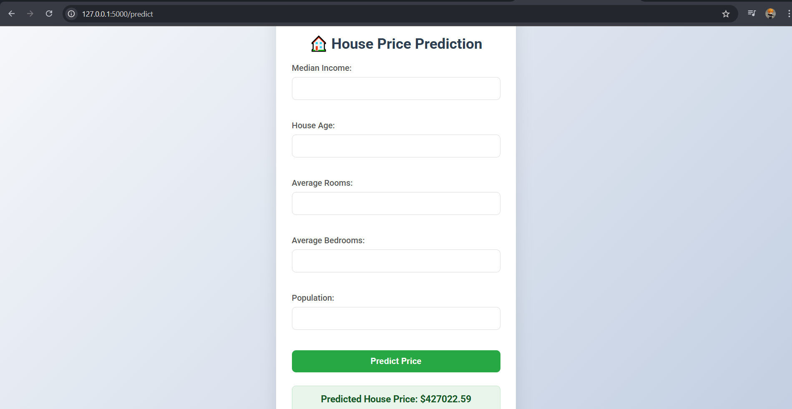

# House Price Prediction Web App

A Flask-based web application to predict house prices using a Linear Regression model trained on the California Housing Dataset.

## Features
- Input form for house features (e.g., median income, house age).
- Predicts house prices using a machine learning model.
- Stylish and responsive design.

## Setup
1. Clone the repository:
   
   ```bash
   git clone https://github.com/abhishek-sakpal/house-price-prediction.git
3. Install dependencies:

   ```bash
   pip install -r requirements.txt
5. Train the model:

   ```bash
   python model.py
7. Run the app:

   ```bash
   python app.py
9. Screenshot:

   

   
   
   
